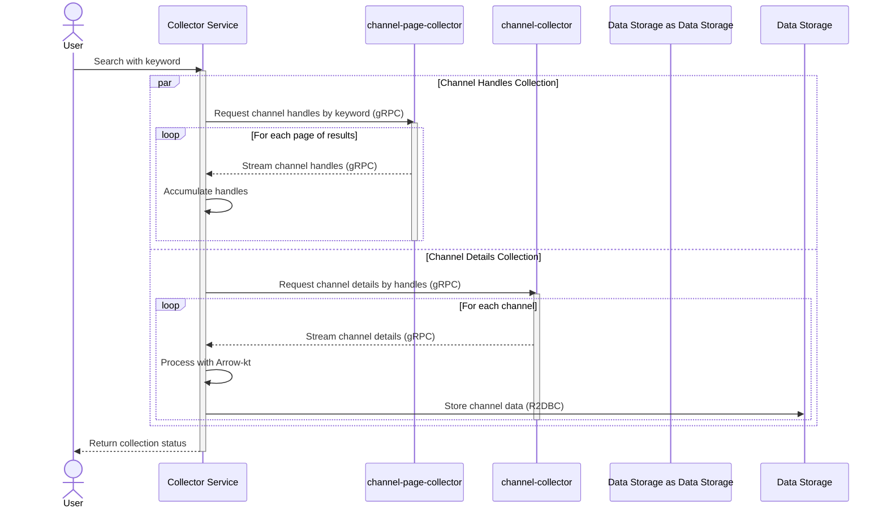

# Youtube's Channel Collector

 

This service collects YouTube channel data based on a keyword search.

When you initiate a search with a keyword, the service collects a list of channels through [channel-page-collector](https://github.com/Sujin1135/channel-page-collector) and retrieves detailed channel data through [channel-collector](https://github.com/Sujin1135/channel-collector) simultaneously using [gRPC streaming](https://www.baeldung.com/java-grpc-streaming).

## Flow

The service follows this collection flow when you provide a keyword:

1. **Search Start**: You provide a keyword to search for YouTube channels
   
2. **Parallel Collection Process**:
   - **Channel Pages Collection**: 
     - The service connects to [channel-page-collector](https://github.com/Sujin1135/channel-page-collector) via gRPC
     - Streams YouTube channel handles found for the provided keyword
     - Handles are collected page by page and streamed back

   - **Channel Details Collection**:
     - For each batch of handles received, connects to [channel-collector](https://github.com/Sujin1135/channel-collector) via gRPC
     - Requests detailed information for each channel (subscriber count, view count, description, etc.)
     - Streams the detailed channel information back to the main service

3. **Data Storage**:
   - Channel information is stored in the database via R2DBC
   - This enables non-blocking database operations

### Collection Flow Diagram

## Test

This project includes tests that verify the collection flow for various input and output scenarios, covering both success and failure cases.

The testing approach uses Testcontainers to dockerize real database interactions while mocking calls to external services. This approach ensures that we can effectively verify the application's behavior without depending on external services during tests.
